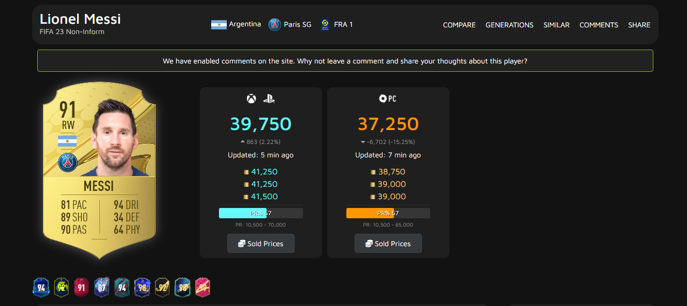
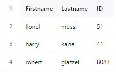
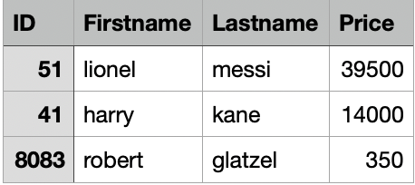
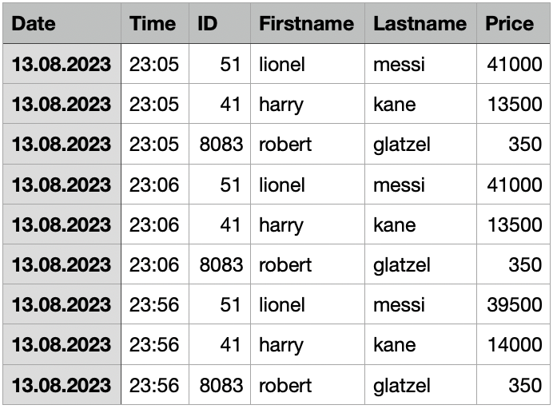
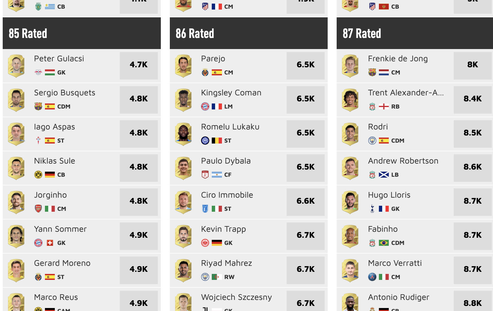
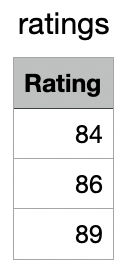
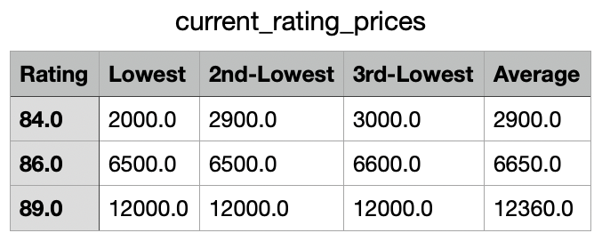
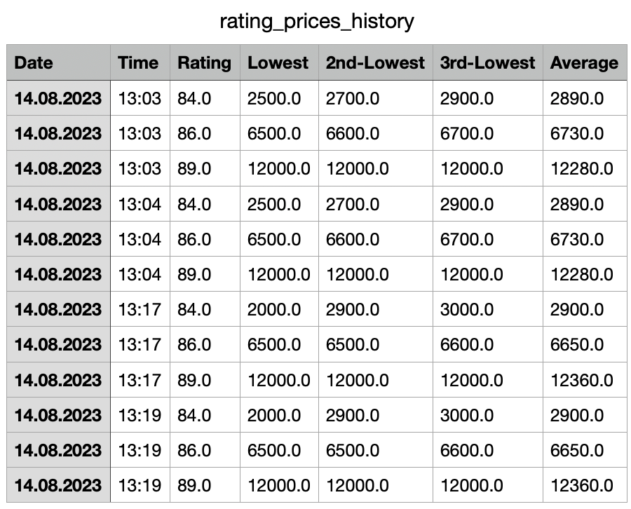
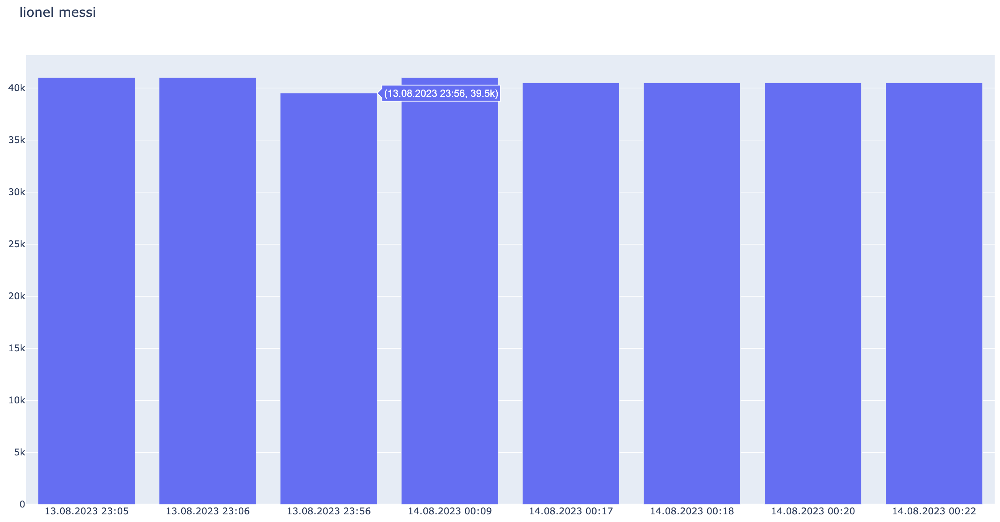
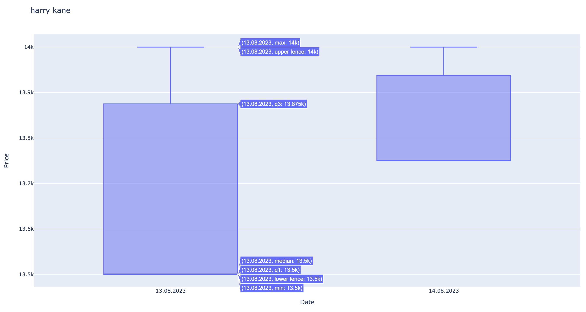

# EA Sports FUT 23 - Player-Tracker
 In this project, I will pull and analyze the prices of selectable players from the FUTWIZ-Website

## Scraping individual players
If you visit the FUTWIZ Website and choose a player the website tells you the current lowest price of the player:

For the URL of the player's website you just need:
- the base URL ("https://www.futwiz.com/en//fifa23/player/")
- the first name of the player
- the last name of the player
- the ID of the individual card
  
Example URL: https://www.futwiz.com/en//fifa23/player/lionel-messi/51

So in the first step, I create a CSV-File with the players which I want to check the price from:

Now with the information about the player, we can start the Web scraping (scraping_fifa_prices.py):

The first Python script pulls the prices of the players and put them into a DataFrame
Then it saves the newest prices into the "current_prices.csv" file

Also, it appends the prices to the "price_history" which has the additional columns:
- Date
- Time

  

## Scraping prices by rating

FUTWIZ has another nice option:
On the page with the URL "https://www.futwiz.com/en/lowest-price-ratings" you can see the lowest 10 prices by players with ratings from 82-99. These are important for SBCs and many of them have massive price fluctuations. That's why it's useful to look at them as well.

Like I explained before with the individual players, I create a CSV File with the current prices and also create a history-file to see the trend of the price over time. But in this case I chose some different columns:
- Date
- Time
- Lowest
- 2nd-Lowest
- 3rd-Lowest
- Average (of the 10 lowest prices)

  I chose these columns, because especially if you look at higher ratings there are big differences between the lowest and highest of the 10 prices. So the pure average doesn't tell you the real situation. 
  I also save the 3 lowest prices as their own, because there are moments when the lowest is insanely lower than the others, that's why I save 3 prices just to see if it's a realistic price for all the players with the rating or just a peak of one player.

  Now the scraping is done and we are getting the data we need to analyze the trend of the price.
To get a reasonable amount of data we have to make sure that the scraping is executed in determined time steps: e.g. every hour
 
# Visualization 

As we got the data, we can start to create some graphics from it, first we maybe just want to see the history (analyze.py):

For example i created a
- hourly graph (Bar-diagram - just to see the price evolution over time)
- daily graph (boxplots - to see the days peaks and average)

note: the time steps are not hours in the picture, because I didn't execute the scraping suitable

### Next steps

From here on I want to implement other methods to analyze the trend of the prices.
For example:
- Is the price increasing over last hours/days/weeks ?
- Is it frequently peaking up/down at some point in the week / at a day

Also, in regard to investing in / trading with players, I want to calculate automatically  
- the raw value of the players 
- the current profit (minus 5% EA taxes)
- maybe some prediction when the best moment comes to sell
- if the profit I hoped for is reached -> then sending me a message that I can sell the players and earn the profit
  
in the same time steps I execute the scraping.
